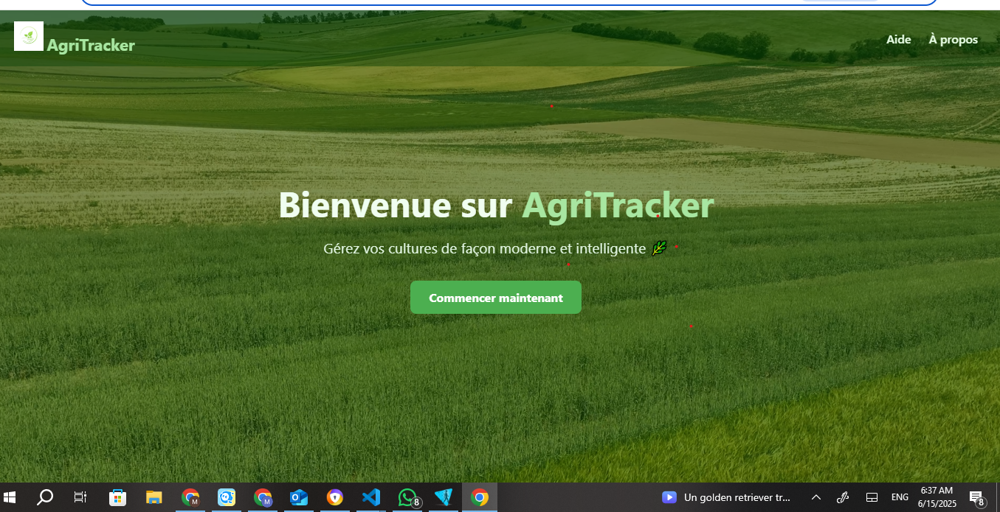
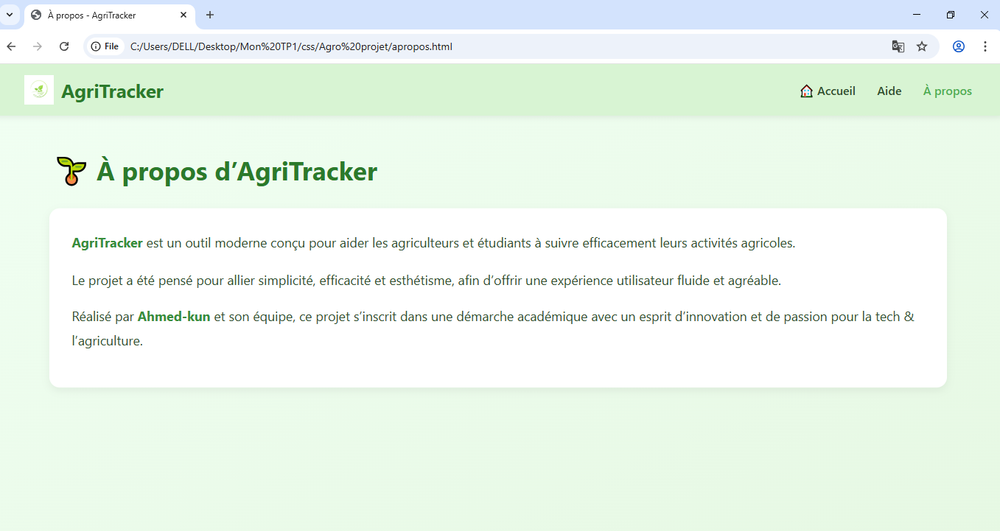
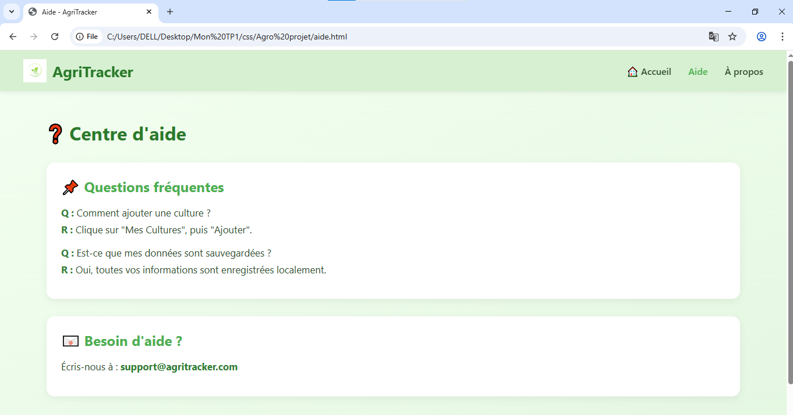
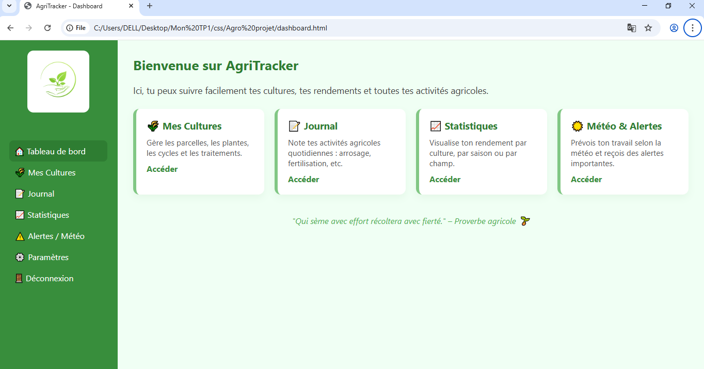
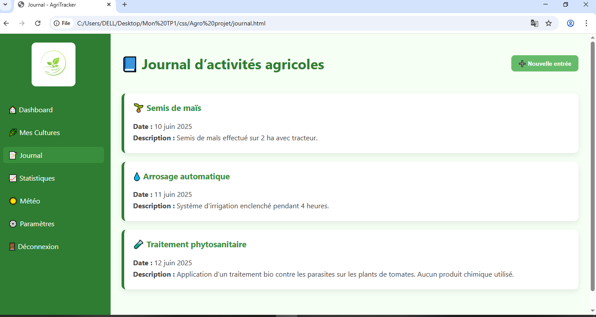
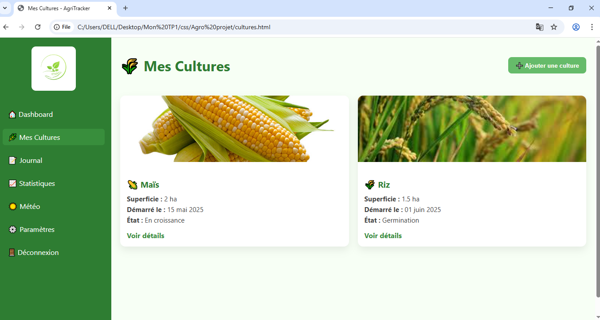
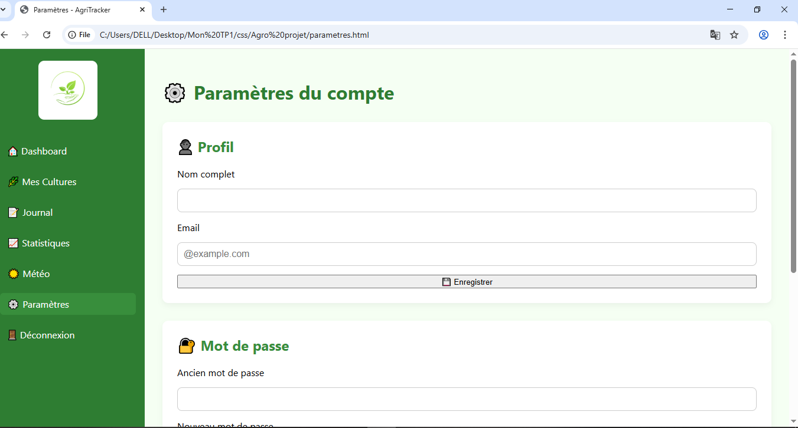
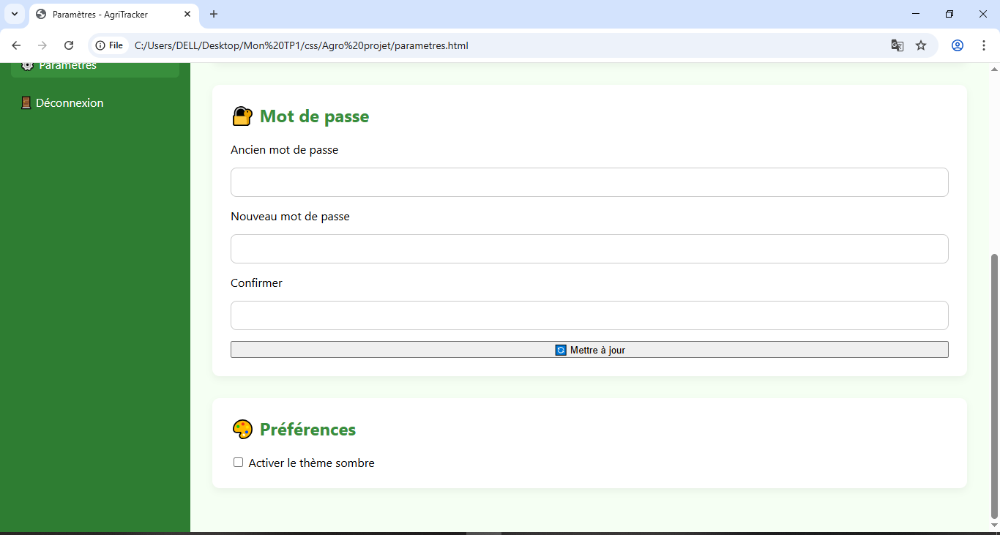
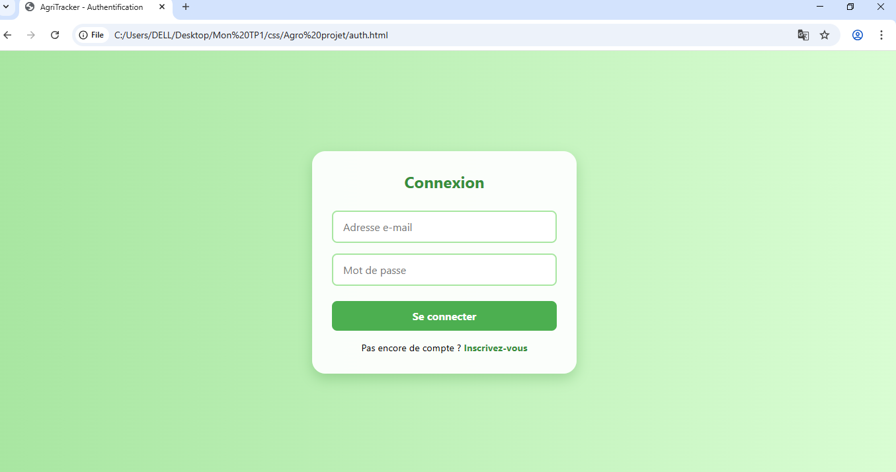
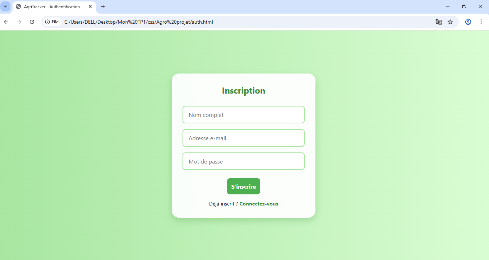

# Atelier-de-D-Web-AgriTrack 
Nom de la solution : AgriTrack - Outil de Suivi de Production Agricole.

Objectif du projet : Permettre aux agriculteurs de suivre, gérer et optimiser leur production agricole via une application web intuitive.

Membres du groupe :
                    Seydina Issa Laye Faye : 🔁 Responsable Git/GitHub – crée et gère le dépôt, les branches, les commits
                                             📝 Responsable Documentation – rédige le README, suit le Trello
                                             
                   Mouhammed Sall : 🎨 Responsable Design – crée les maquettes, gère les couleurs, styles, responsive
                                     💻 Responsable Développement – code les pages HTML/CSS/JS
                                     
Technologies utilisees : HTML / CSS / JavaScript
                         /Git & GitHub
                         /Trello
                         
Lien vers Trello : [AgriTrack - Tableau Trello](https://trello.com/b/VLvgZBSY/agritrack-agricultural-production-tracking)

## 📸 Aperçu de l'application

### 🏠 Accueil

### 🙋‍♂️ À propos

### 🆘 Aide

### 📊 Dashboard

### 📘 Journal

### 🌾 Mes Cultures

### ⚙️ Paramètres (1)

### ⚙️ Paramètres (2)

### 🔐 Se connecter

### 📝 S'inscrire

